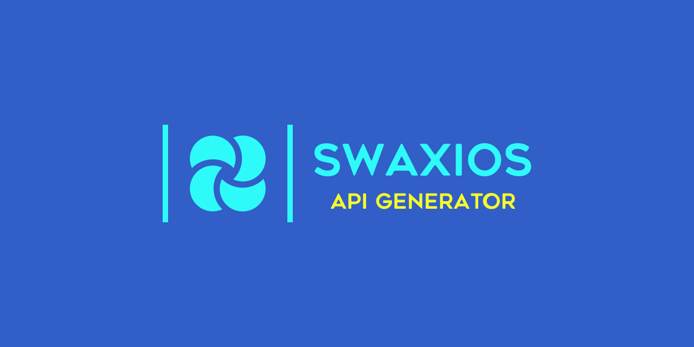

# Swaxios

A [Swagger](https://swagger.io/) API client generator based on [axios](https://github.com/axios/axios) and written in [TypeScript](https://www.typescriptlang.org/).

## CLI Usage

```
USAGE

  swaxios

OPTIONS

  -i, --input <file>           Set the input file           required
  -o, --output <directory>     Set the output directory     required

GLOBAL OPTIONS

  -h, --help        Display help
  -V, --version     Display version
  --no-color        Disable colors
  --quiet           Quiet mode - only displays warn and error messages
  -v, --verbose     Verbose mode - will also output debug messages
```

If you pass an [OpenAPI definition](https://swagger.io/docs/specification/2-0/basic-structure/) file (v2.0; valid JSON or YAML) to Swaxios, then it will generate you an API client that uses axios under the hood and is written in TypeScript.

Examples:

```
swaxios -i ./path/to/swagger.json -o ./path/to/output/directory
swaxios -i ./path/to/swagger.yml -o ./path/to/output/directory
```

## Generated API Client Usage

Example using a Node.js API which has been automatically generated by Swaxios:

**YourApp.ts**

```ts
import {APIClient} from 'swaxios';

const accessToken = 'secret-access-token';

const client = new APIClient('https://staging-nginz-https.zinfra.io');
client.defaults.headers.common['Authorization'] = `Bearer ${decodeURIComponent(accessToken)}`;
client.api.identityProvidersService
  .getById('some-id')
  .then(response => console.log('Response', response))
  .catch(error => {
    if (error.response.status === 401) {
      throw Error('Did your access token expire?');
    }
  });
```

Inspired by [swagger-codegen](https://github.com/swagger-api/swagger-codegen).
